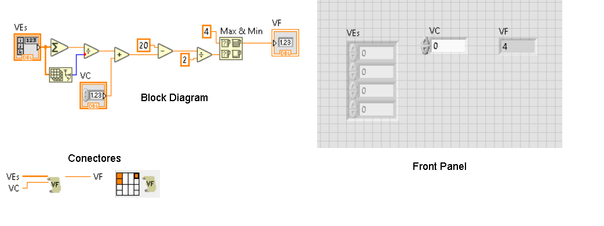

O programa calcula a nota final necessária para aprovação no semestre utilizando um número a determinar de notas de VE e nota de VC.
O esquemático do programa(front panel, block diagram e conectores) é o seguinte:
